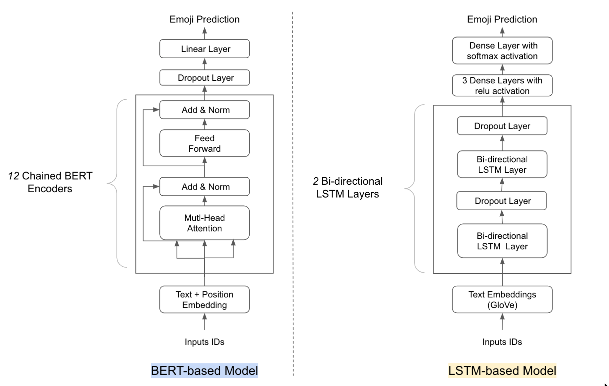
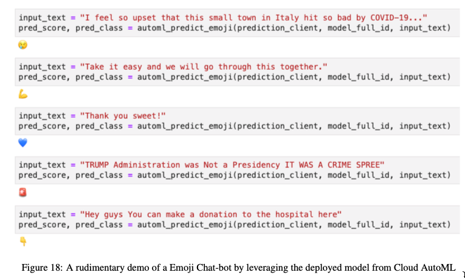

#### XCS-229U Final Project

Author: Han Yu and Lubo Han

#### TL;DR

Emojis are widely used in social media, blogs, and instant messages to express users’ emotions and intentions. In this
report, we present our analysis protocol and preliminary results to predict emojis based on open text in English by
using the “English Tweet, with Emoji” dataset from Kaggle.

#### Summary of Results

Our project idea is that given input texts to Chat Bot, based on the prediction of the sentiment and the topic
discovered in the input text, the Chat Bot will return an Emoji which “Emphasizes” the topic with empathy. The problem
we are trying to solve can be used for sentiment understanding of the text input, and it can also be used to build an
emoji recommendation system to enrich text-based sentences.

We have fine-tuned a BERT based multi-class classifier to explore the state-of-the-art BERT framework; we also explored
those popular seq2seq models by designing a LSTM-based multi-class classifier. Last but not least, we have also
leveraged Google Cloud AutoML to auto-train a multi-class emoji classifier using the same training dataset. The model
generated by Cloud AutoML will be used for benchmark studies.

Different Models explored in the project.

See sample responses produced from the emoji chat-bot below.

#### Final Paper

Final paper can be viewed and be
downloaded [here](https://github.com/bearbearyu1223/XCS224U-Project-Emoji-ChatBot/blob/main/final_report/Emoji_Chatbot.pdf)
.

#### Future Work

Due to limited bandwidth, most of the work reported in the final project paper are implemented in Juypter Notebook. We
will re-engineer and improve the codebase into a deployable small app in the near futures.

#### Contact

Aside from my busy day work and other life commitment, I am a believer of *constant learning*. Learning something new
every day(big or small, does *not* have to be a technical skill), will make a huge difference in the long term.

My LinkedIn profile is shared at [han-yu-go-irish](https://www.linkedin.com/in/han-yu-goirish/).
